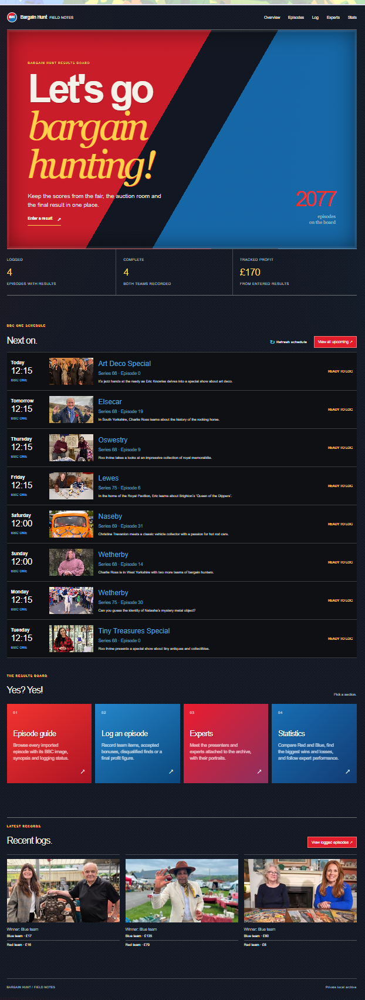
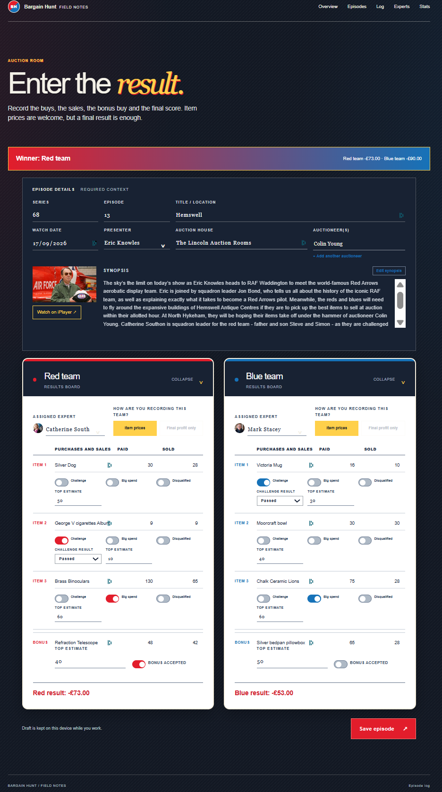
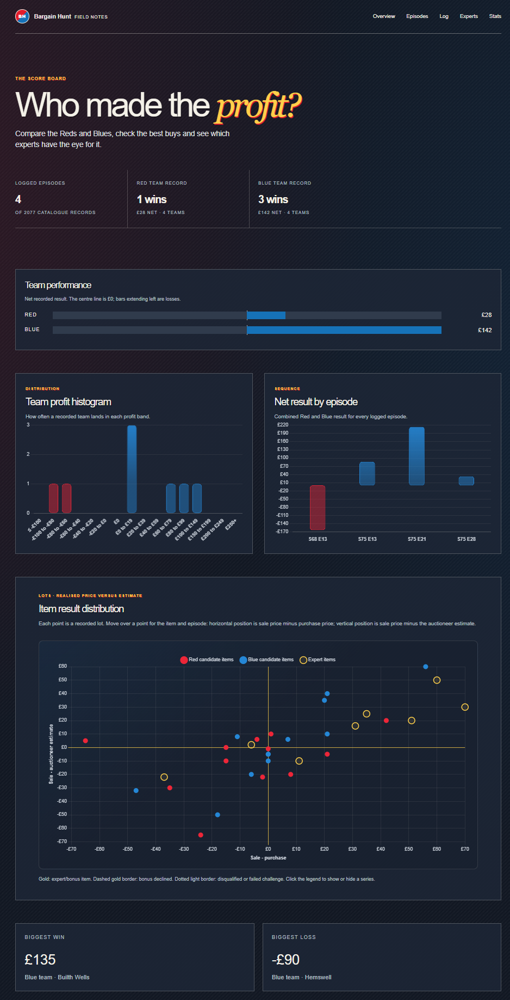
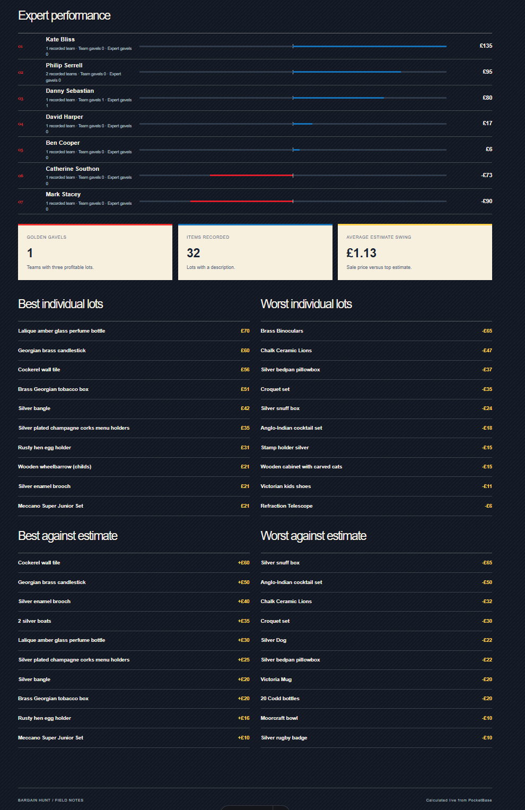

# Bargain Hunt · Field Notes

A private Astro and PocketBase archive for recording Bargain Hunt episodes, team lots, final results, and expert performance.

## Screenshots

The repository includes a static visual tour in [`docs/screenshots/`](docs/screenshots/). It shows the application without requiring a live server or PocketBase connection.

### Overview



### Episode guide


### Episode logger



### People directory


### Statistics





## Maintainer documentation

The full human-maintainer guide is in [`wiki/`](wiki/Home.md). It is written as GitHub Wiki pages and covers:

- [site structure and reusable components](wiki/Site-map-and-components.md);
- [editing episodes, people, teams, and lot data](wiki/Editing-archive-data.md);
- [statistics and adding Chart.js charts](wiki/Charts-and-statistics.md);
- [Docker self-hosting and safe updates](wiki/Docker-self-hosting.md).

## Local development

Requirements: Node.js 22.12 or later and a reachable PocketBase server.

```sh
npm install
npx astro dev --background
```

The site runs at `http://localhost:4321`. Use `npx astro dev status`, `npx astro dev logs`, and `npx astro dev stop` to manage the background server. Set `POCKETBASE_URL=http://localhost:8090` when PocketBase runs on your development machine.

Build the production application with:

```sh
npm run build
```

## Data setup and import

Import [`pb_schema.json`](pb_schema.json) through the PocketBase Admin UI for a new empty database. Then import the BBC catalogue:

```sh
POCKETBASE_URL=http://localhost:8090 npm run import:bbc
```

The normal import is non-destructive. See the wiki before using the `import:bbc:nuclear` or auctioneer-migration scripts.

## Docker deployment

The supported self-hosted configuration is [`deploy/docker-compose.yml`](deploy/docker-compose.yml). Copy [`deploy/.env.example`](deploy/.env.example) to `deploy/.env`, set unique passwords, then start it from the repository root:

```sh
docker compose --env-file deploy/.env -f deploy/docker-compose.yml up -d --build
```

The older Portainer-oriented configuration and security notes remain in [`deploy/README.md`](deploy/README.md). Do not expose PocketBase directly to the network.
